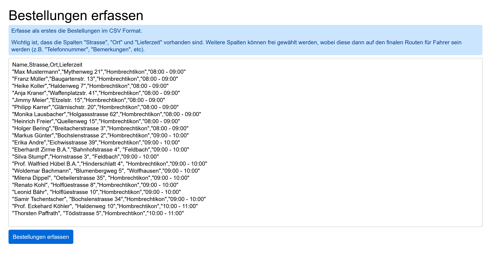
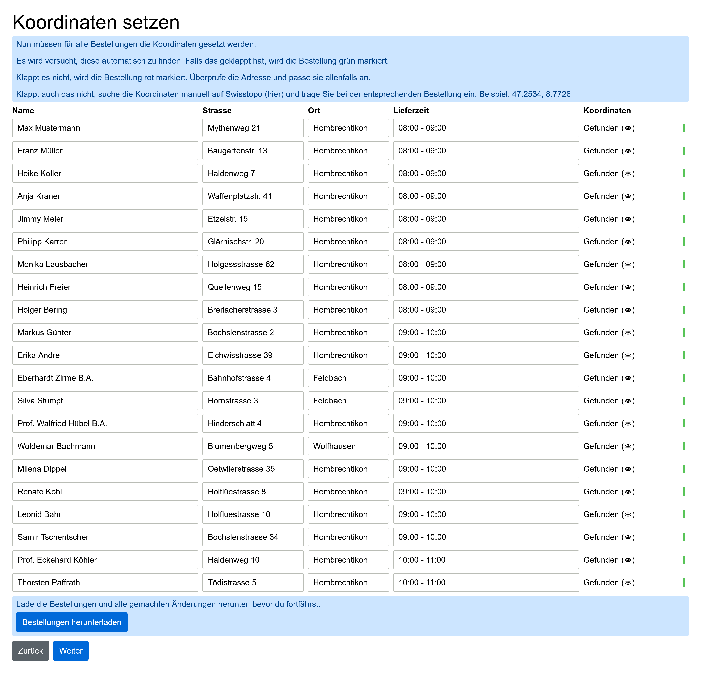
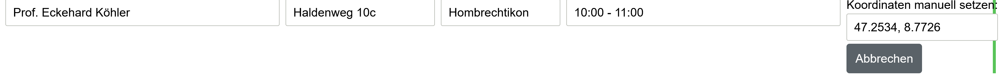
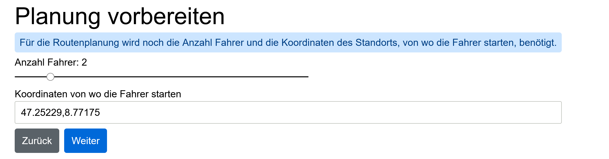

# Delivery Route Planner

This web application, written in Elm, simplifies the process of planning
delivery routes. It was initially developed for [Cevi Hombi](https://cevi-hombi.ch/),
an organization that organizes an annual event around Christmas where customers
can order homemade [Zopf](https://en.wikipedia.org/wiki/Zopf) to be delivered.

Created for fun and as a means to learn Elm, this application does not guarantee
high quality and lacks tests and translations.

## Access

Access the web application here: [URL to web application]

Example data is hardcoded. Replace it as needed.

## Example

Access the web application at the provided link and follow the process using
the example data. [Here](docs/example-routes-output.pdf) you find the sample
output of the delivery routes from the example data.

Each step is described in more detail below.

### 1. Input

Begin planning by entering the required information:

|  |
|:--------------------------------------:|

The following columns are required:

- Strasse
- Ort
- Lieferzeit

Additional columns will appear in the output, such as phone numbers or notes.
However, limit the amount of information to ensure proper formatting on the
output A4 pages (landscape).

### 2. Fetch Coordinates

Coordinates are fetched using the Nominatim API, throttled to one request every
two seconds.

|  |
|:----------------------------------------------------------:|

If coordinates are not found, correct the address or enter them manually.

|  |
|:----------------------------------------------------------------------------:|

### 3. Cluster Deliveries

Configure the number of drivers and headquarters coordinates for deliveries.

|  |
|:------------------------------------------------------------------:|

The application assigns deliveries to drivers, creating a delivery route for
each driver within their respective delivery windows. Visually review and
adjust the generated routes as needed by clicking on the corresponding delivery
points on the map. Note that the application clusters deliveries by location,
without calculating actual routes, which may result in non-optimal or illogical
routes (e.g., caused by dead ends or lack of connecting streets).

|  |
|:------------------------------------------------------------------:|

### 4. Print Deliveries

On the final page, print the delivery route for each driver. Use the browser's
print page functionality (best results in landscape format).

|[Example Routes Output PDF](docs/example-routes-output.pdf)|
|:---------------------------------------------------------:|

## Known Issues

- The state is lost on reload
